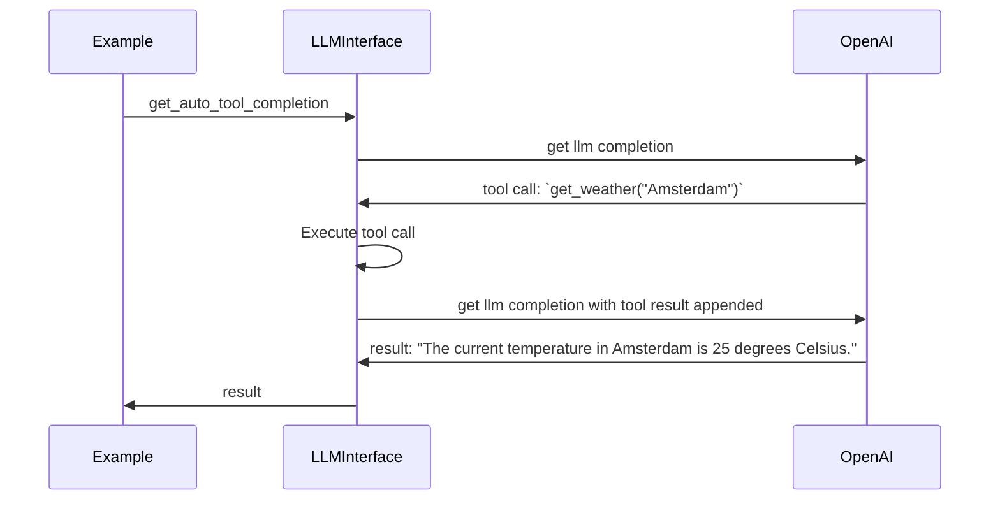

# LLM Interface

LLMs are awesome but working with them can be tricky. There are a lot of complex frameworks and packages that hide the complexity but obfuscate certain features or make it hard to adapt to the quickly changing advancements in AI.

This is a simple interface to handle the basics.

Features:
- Pretty logging for debugging
- Tool call handling
- Python method definiton to LLM
- Metering (e.g. duration, costs, tokens etc)

To add:
- Caching
- Retry
- Simple parallel/batch calls
- Other LLM providers

## Examples

Simplest example:
```python
# Example 1
from llm_interface import LLMInterface

llm_interface = LLMInterface(openai_api_key="YOUR_OPENAI_API_KEY")

simple_result = await llm_interface.get_completion(
    messages=[
        {"role": "user", "content": "What is the capital of the Netherlands?"},
    ],
    model="gpt-4o-mini",
)
simple_result.content
#> The capital of the Netherlands is Amsterdam.
```

Besides the result, we can also obtain metadata about the completion:
```python
# Example 1 cont.

simple_result.metadata.duration_seconds
#> 0.8740940093994141

simple_result.metadata.input_tokens
#> 15

simple_result.metadata.output_tokens
#> 9

simple_result.metadata.cost_usd
#> 0.0001275
```
Note that the cost estimation relies on the cost per 1m input and output tokens in `llm.py`. Please make sure to verify those and only use them as estimates.

### Tool calls

LLMInterface allows you to provide functions as tools to the LLM. It also takes care of the conversion of the function signature to JSON and the execution of the tool.
```python
# Example 2

def get_weather(city: str) -> str:
    """Get the current temperature for a given location
    
    :param city: City and country e.g. Bogotá, Colombia
    """
    return "25 degrees Celsius"

tool_call_result = await llm_interface.get_auto_tool_completion(
    messages=[
        {"role": "user", "content": "What is the weather in Amsterdam?"},
    ],
    model="gpt-4o-mini",
    auto_execute_tools = [get_weather],
)
tool_call_result.content
#> The current temperature in Amsterdam is 25 degrees Celsius.
```

In the example above, the LLM will first return a tool call asking for the execution of the `get_weather` function with the argument `"Amsterdam"`. Then the LLM will execute the tool call and prompt the LLM for a second time with the newly added tool call result. The flow is as follows:

To prevent infinite recursion the `max_depth` parameter can be used to limit the amount of LLM calls. 

Only tools in `auto_execute_tools` are executed automatically. Tools in `non_auto_execute_tools` are not executed automatically and will cause the method to return the result up to that point. This allows you to manually execute the tools as needed.

In this case we can get the metadata for the total process involving multiple LLM calls:

```python
# Example 2 cont.

tool_call_result.llm_call_count
#> 2

# Total in- and output tokens used in two LLM calls combined
tool_call_result.metadata.input_tokens, tool_call_result.metadata.output_tokens
#> 155, 30

# Total estimated cost in USD
tool_call_result.metadata.cost_usd
#> 0.0006875
```

It is also possible to get the individual messages that were added to the chat. This includes LLM completions as well as the tool call results.
```python
# Example 2 cont.
import json

# Print as json for legibility
json.dumps(
    [message.model_dump()for message in tool_call_result.messages], 
    indent=2
)
#> [
#>   {
#>     "role": "assistant",
#>     "content": null,
#>     "tool_calls": [
#>       {
#>         "id": "call_JTKejIGvWDV2GgfBU1WlosOX",
#>         "name": "get_weather",
#>         "arguments": {
#>           "city": "Amsterdam, Netherlands"
#>         }
#>       }
#>     ],
#>     "metadata": ... # Metadata of the first LLM completion, left out for brevity
#>   },
#>   {
#>     "role": "tool",
#>     "content": "25 degrees Celsius",
#>     "tool_call_id": "call_JTKejIGvWDV2GgfBU1WlosOX",
#>     "raw_content": "25 degrees Celsius"
#>   },
#>   {
#>     "role": "assistant",
#>     "content": "The current weather in Amsterdam is 25 degrees Celsius.",
#>     "tool_calls": [],
#>     "metadata": ... # Metadata of the second LLM completion, left out for brevity
#>   }
#> ]
```

## Using

Run tests by running `pytest` in the root of the project.

## Links

[My personal website](https://www.willemdebeijer.com)