# LLM Interface

_The minimal dependency, maximal power way to call LLMs._

As simple as the `Python OpenAI` package but as powerful as overly complicated packages. Build and debug LLM applications such as AI Agents with Python function -> tool call conversion, a web interface for debugging, automated cost and usage tracking and more.

This is a simple interface to handle the basics. It's very hackable and only depends on `pydantic` and `aiohttp`.

Features:
- Pretty logging for debugging
- Tool call handling
- Python method definiton to LLM
- Metering (e.g. duration, costs, tokens etc)

To add:
- Caching
- Retry
- Simple parallel/batch calls
- Other LLM providers

## Chat Viewer

Creating a `LLMInterface` with argument `debug=True` will every chat to a JSON file. These can be easily inspected in the browser by running `llm-interface` in the terminal.


The viewer has a lot of useful metadata out of the box such as duration of calls, tokens used and even cost estimations.

## Examples

### 1. Simplest example
```python
# Example 1
from llm_interface import LLMInterface

llm_interface = LLMInterface(openai_api_key="YOUR_OPENAI_API_KEY")

simple_result = await llm_interface.get_completion(
    messages=[
        {"role": "user", "content": "What is the capital of the Netherlands?"},
    ],
    model="gpt-4o-mini",
)
simple_result.content
#> The capital of the Netherlands is Amsterdam.
```

Besides the result, we can also obtain metadata about the completion:
```python
# Example 1 cont.

simple_result.metadata.duration_seconds
#> 0.8740940093994141

simple_result.metadata.input_tokens
#> 15

simple_result.metadata.output_tokens
#> 9

simple_result.metadata.cost_usd
#> 0.0001275
```
Note that the cost estimation relies on the cost per 1m input and output tokens in `llm.py`. Please make sure to verify those and only use them as estimates.

### 2. Tool calls

LLMInterface allows you to provide functions as tools to the LLM. It also takes care of the conversion of the function signature to JSON and the execution of the tool.
```python
# Example 2
from llm_interface import LLMInterface

llm_interface = LLMInterface(openai_api_key="YOUR_OPENAI_API_KEY"

def get_weather(city: str) -> str:
    """Get the current temperature for a given location
    
    :param city: City and country e.g. Bogotá, Colombia
    """
    return "25 degrees Celsius"

tool_call_result = await llm_interface.get_auto_tool_completion(
    messages=[
        {"role": "user", "content": "What is the weather in Amsterdam?"},
    ],
    model="gpt-4o-mini",
    auto_execute_tools = [get_weather],
)
tool_call_result.content
#> The current temperature in Amsterdam is 25 degrees Celsius.
```

In the example above, the LLM will first return a tool call asking for the execution of the `get_weather` function with the argument `"Amsterdam"`. Then the LLM will execute the tool call and prompt the LLM for a second time with the newly added tool call result. The flow is as follows:

```mermaid
sequenceDiagram
    participant Example
    participant LLMInterface as LLMInterface
    participant OpenAI as OpenAI

    Example->>+LLMInterface: get_auto_tool_completion<br />"What is the weather in Amsterdam?"

    Note over LLMInterface,OpenAI: Get LLM completion 1
    LLMInterface->>+OpenAI: [🟢 User message]
    OpenAI-->>-LLMInterface: [🔵 LLM message (tool call)]

    LLMInterface->>LLMInterface: Execute tool call

    Note over LLMInterface,OpenAI: Get LLM completion 2
    LLMInterface->>+OpenAI: [🟢 User message]<br />[🔵 LLM message (tool call)]<br />[🟣 Tool result]
    OpenAI-->>-LLMInterface: [🔵 LLM message ("The current temperature <br />in Amsterdam is 25 degrees Celsius."]

    LLMInterface-->>-Example: "The current temperature <br />in Amsterdam is 25 degrees Celsius."
```

To prevent infinite recursion the `max_depth` parameter can be used to limit the amount of LLM calls. 

Only tools in `auto_execute_tools` are executed automatically. Tools in `non_auto_execute_tools` are not executed automatically and will cause the method to return the result up to that point. This allows you to manually execute the tools as needed.

In this case we can get the metadata for the total process involving multiple LLM calls:

```python
# Example 2 cont.

tool_call_result.llm_call_count
#> 2

# Total in- and output tokens used in two LLM calls combined
tool_call_result.metadata.input_tokens, tool_call_result.metadata.output_tokens
#> 155, 30

# Total estimated cost in USD
tool_call_result.metadata.cost_usd
#> 0.0006875
```

It is also possible to get the individual messages that were added to the chat. This includes LLM completions as well as the tool call results.
```python
# Example 2 cont.
import json

# Print as json for legibility
json.dumps(
    [message.model_dump()for message in tool_call_result.messages], 
    indent=2
)
#> [
#>   {
#>     "role": "assistant",
#>     "content": null,
#>     "tool_calls": [
#>       {
#>         "id": "call_JTKejIGvWDV2GgfBU1WlosOX",
#>         "name": "get_weather",
#>         "arguments": {
#>           "city": "Amsterdam, Netherlands"
#>         }
#>       }
#>     ],
#>     "metadata": ... # Metadata of the first LLM completion, left out for brevity
#>   },
#>   {
#>     "role": "tool",
#>     "content": "25 degrees Celsius",
#>     "tool_call_id": "call_JTKejIGvWDV2GgfBU1WlosOX",
#>     "raw_content": "25 degrees Celsius"
#>   },
#>   {
#>     "role": "assistant",
#>     "content": "The current weather in Amsterdam is 25 degrees Celsius.",
#>     "tool_calls": [],
#>     "metadata": ... # Metadata of the second LLM completion, left out for brevity
#>   }
#> ]
```

### 3. Agent

The term "agent" is used a lot but it generally refers to a program that consists of multiple LLM calls and in many cases can take actions. An agent generally has one or more tools that can be separated into three categories: inputs, processing and outputs.

Input tool examples:
- Search the web
- Read from private knowledge base
- Read from database or API

Processing tool examples:
- Execute code in sandbox

Output tool examples:
- Call endpoint to perform an action
- Update internal knowledge base

A simple agent can look like this:
```python
# Example 3

class Agent:
    def __init__(self, llm_interface: LLMInterface):
        self.llm_interface = llm_interface

    def forward(self, question: str) -> str:
        result = await self.llm_interface.get_auto_tool_completion(
            messages=[
                {"role": "system", "content": "Be helpful and concise."}
                {"role": "user", "content": question},
            ],
            model="gpt-4o-mini",
            auto_execute_tools = [self.search_web, self.run_code],
        )
        return result.content

    def search_web(self, query: str) -> str:
        """Search the web for a given query
        
        :param query: The query to search for
        """
        ...

    def run_code(self, code: str) -> str:
        """Execute code in sandbox
        
        :param code: The code to execute
        """
        ...
    
```

Many frameworks focus on getting the correct context such as user data in the prompt, but this can be trivially added to the system prompt by providing an additional parameter in `forward`.

### 4. Tools returning complex objects

The LLM requires the tool call result to be a string. Methods that return anything else will have their return value converted to a string using `repr()` before being added to the chat. The original return value of the function will be stored in the `raw_content` field of the tool call result.

Since Pydantic objects have a readable representation by default, they're excellent candidates for complex tool return values.

```python
# Example 4
from llm_interface import LLMInterface
from pydantic import BaseModel

llm_interface = LLMInterface(openai_api_key="YOUR_OPENAI_API_KEY"

class Product(BaseModel):
    _id: str
    name: str
    description: str
    price: float

def lookup_product(id: str) -> str:
    """Get the details of a a product such as name, description and price
    
    :param id: ID of the product
    """
    # In a real application we might query the database or an API here
    return Product(_id="123", name="Pineapple", description="A controversial pizza topping...", price=3.99)

complex_tool_call_result = await llm_interface.get_auto_tool_completion(
    messages=[
        {"role": "user", "content": "What is the price of product 123?"},
    ],
    model="gpt-4o-mini",
    auto_execute_tools = [lookup_product],
)
complex_tool_call_result.content
#> 'The price of the product "Pineapple" is $3.99.'
```

By inspecting the messages we can see the object as it was returned to the LLM or get the actual object.
```python
# Example 4 cont.

from llm_interface.model import LlmToolMessage
tool_message = next(m for m in complex_tool_call_result.messages if isinstance(m, LlmToolMessage))

# String object as it was returned to the LLM
tool_message.content
#> "Product(name='Pineapple', description='A controversial pizza topping...', price=3.99)"

# Actual Python Product object
tool_message.raw_content
#> Product(name='Pineapple', description='A controversial pizza topping...', price=3.99)
```

Note that a custom Python class that does not inherit Pydantic BaseModel will need a custom `__repr__(self)` method to be usable by the LLM.
```python
class CustomProduct:
    def __init__(self, name: str):
        self.name = name

custom_product = CustomProduct("Pineapple")
# This is not usable by the LLM
repr(custom_product)
#> '<__main__.CustomProduct object at 0x10ca25790>'
```

## Using

### Installing

This package is not on PyPI at this moment.

To install in your Python environment run:
```sh
pip install git+https://github.com/willemdebeijer/LLM-Interface.git
```

Or add this line to your `requirements.txt`:
```
git+https://github.com/willemdebeijer/LLM-Interface.git
```

### Adding LLMs

This package is made to be as hackable as possible.

To add a different API that uses the OpenAI format, e.g. Groq:
```python
from llm_interface import LLMInterface
from llm_interface.llm_handler import OpenAiLlmHandler
from llm_interface.llm import LlmProvider, LlmModel

provider = LlmProvider(name="Groq")

llm_interface = LLMInterface(handler=OpenAiLlmHandler(api_key="<your-api-key>", base_url="https://api.groq.com/openai/v1", provider=groq))

# OPTIONAL:
# Add cost estimations by adding a new model
llm = LlmModel(
    name="llama-3.3-70b-specdec",
    provider=provider,
    usd_per_1m_input_tokens=0.59,
    usd_per_1m_output_tokens=0.99,    
)

# Now the model can be used like this:
# result = await llm_interface.get_completion(messages=..., model="llama-3.3-70b-specdec")
```

To add a custom LLM that doesn't use the OpenAI spec, create a subclass of `AbstractLlmHandler`

### Tests

Run tests by running `pytest` in the root of the project.

Run `pytest --run-api` will test the LLMInterface functionality with the live OpenAI API. Note that this requires a `.env` with `OPENAI_API_KEY` and will use up actual API credtis to run.

## Links

[My personal website](https://www.willemdebeijer.com)